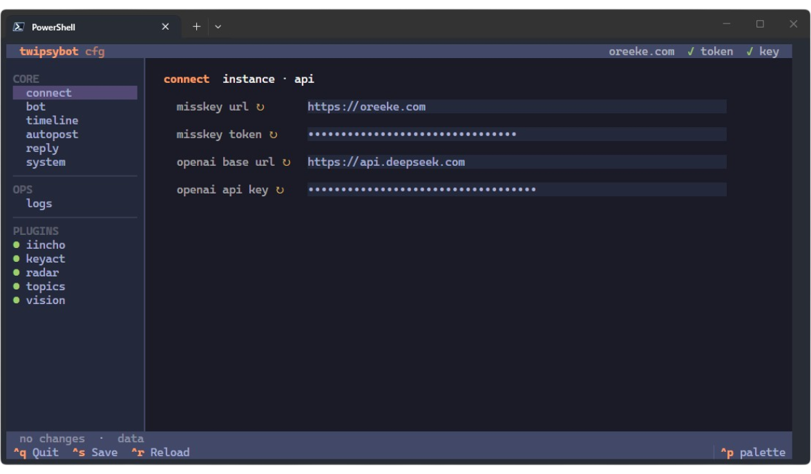

<div align="center">

<p>
    
</p>

<h1>TwipsyBot</h1>

<br>**一只轻量、可扩展的 Misskey AI 机器人**<br><br>
正运行在：[oreeke.com/@ai](https://oreeke.com/@ai)

<a href="https://www.python.org/downloads">
    </a>
<a href="https://github.com/misskey-dev/misskey">
    </a>
<a href="./LICENSE">
    </a>

<br>它有时是抽象气氛组，有时是靠谱小帮手。它把所看所想寄向联邦宇宙，也把星尘里的帖子带回家。

··· [使用手册](https://twipsybot.oreeke.com/) ··· [开发指南](https://twipsybot.oreeke.com/dev-guide/) ··· [变更日志](./CHANGELOG.md) ···
<br><br>❤️<br><br>

<div align="left">

```bash
# copy & edit docker-compose.yaml

docker compose up -d
docker compose exec twipsybot twipsybot cfg

# done
```

</div>



</div>

## License

© 2025 OREEkE and contributors

Code: [AGPL-3.0-or-later](./LICENSE) · Docs: [CC BY-SA 4.0](./docs/LICENSE)
