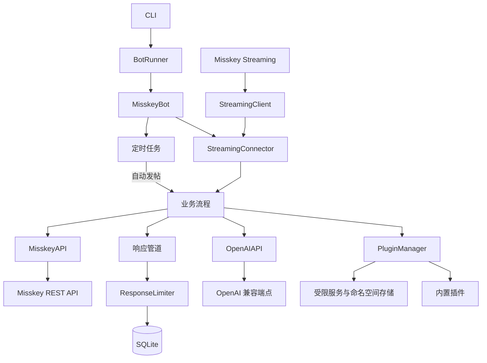

# 架构

TwipsyBot 是单进程异步应用。核心负责连接、事件分发和状态管理，插件通过稳定上下文使用受限服务，不直接依赖内部实现。

## 架构图



## 文件结构

```text
twipsybot/
├── twipsybot/
│   ├── admin/              聊天管理命令
│   ├── app/                CLI 与应用入口
│   ├── bot/
│   │   ├── engine/         核心编排、连接、限流与运行状态
│   │   └── flows/          聊天、提及、通知、发帖与图片流程
│   ├── clients/
│   │   ├── misskey/        Misskey REST 与 Streaming 客户端
│   │   └── openai/         OpenAI 兼容客户端
│   ├── db/                 SQLite 状态存储
│   ├── plugin/             插件公共 API、契约与加载机制
│   └── shared/             配置、异常、锁与通用工具
├── plugins/                内置插件及其配置
├── tests/                  单元、插件与端到端测试
├── docs/                   用户指南与开发指南
├── config.yaml.example     主配置示例
├── docker-compose.yaml.example
├── Dockerfile
└── pyproject.toml          项目元数据与工具配置
```

## 启动与停止

`twipsybot run` 从 `twipsybot.app.cli` 进入 `BotRunner`：

1. 加载 `.env`、`config.yaml` 和环境变量。
2. 验证配置并初始化日志。
3. 创建 `MisskeyBot`，连接 SQLite、Misskey 和 Streaming API。
4. 加载插件、管理命令和定时任务。
5. 等待终止信号，并按生命周期关闭插件、客户端和数据库。

Linux 接收 `SIGINT`、`SIGTERM` 和 `SIGHUP`，Windows 接收 `SIGINT` 和 `SIGTERM`。停止流程会先暂停新插件 Hook，再等待正在运行的 Hook 结束。

## 模块边界

| 目录 | 职责 |
| --- | --- |
| `twipsybot/app` | CLI、进程启动、信号与退出码 |
| `twipsybot/bot/engine` | 核心编排、连接、限流、响应管道和运行状态 |
| `twipsybot/bot/flows` | 提及、聊天、通知、发帖和图片流程 |
| `twipsybot/clients` | Misskey 与 OpenAI 兼容服务适配 |
| `twipsybot/db` | SQLite 状态存储 |
| `twipsybot/plugin` | 插件公共 API、事件、契约和加载器 |
| `twipsybot/shared` | 配置、常量、异常、锁和通用工具 |
| `plugins` | 内置插件及其配置 |

## 消息响应管道

提及和聊天以用户为粒度串行处理：

1. 检查回复间隔、轮数和黑名单。
2. 按优先级调用插件 Hook。
3. 插件返回 handled 结果时发送插件回复并停止后续处理。
4. 没有插件接管时调用文本模型。
5. 发送结果并更新回复限制状态和聊天上下文。

管理员命令使用独立入口，但同样通过用户锁避免同一账号并发修改状态。

## 数据与并发

SQLite 使用三类状态：自动发帖计数、用户回复限制和插件私有数据。管理命令覆盖也保存在插件私有键值表中。插件只能通过命名空间隔离的 `PluginStorage` 读写自己的字符串数据。

核心使用 actor lock 串行化同一用户的操作。不同用户和不同事件仍可并发处理，因此共享内存状态必须自行同步。插件 Hook 超时为 180 秒，生命周期方法为 30 秒；关闭时为 Hook 保留 3 秒，整体最多等待 5 秒。

## 修改原则

- 协议差异放在 `clients`，业务流程放在 `flows`。
- 跨流程状态与调度放在 `engine`，不要复制到多个 handler。
- 可独立启停的能力优先作为插件实现。
- 插件公共能力通过 `twipsybot.plugin` 扩展，不向插件暴露内部对象。
