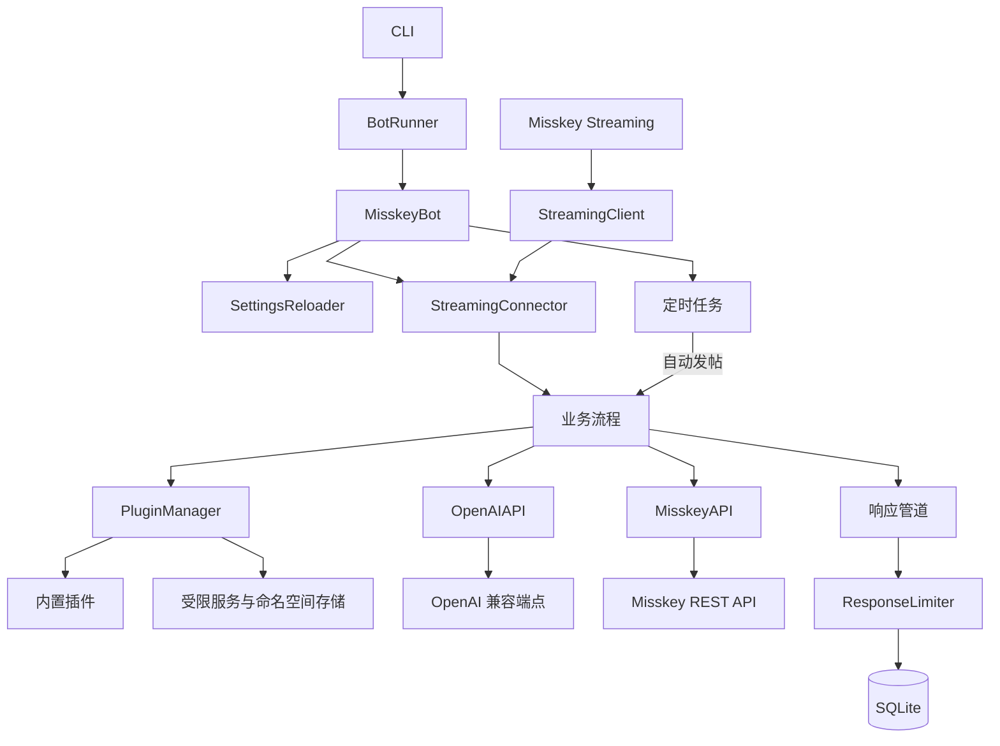

# 架构

TwipsyBot 是单进程异步应用。

核心负责连接、事件分发、设置热重载和状态管理，插件通过稳定上下文使用受限服务，不直接依赖内部实现。

## 系统概览


```mermaid
%%{init: {"flowchart": {"curve": "linear", "nodeSpacing": 32, "rankSpacing": 44}}}%%
flowchart TB
	CLI[CLI] --> Runner[BotRunner]
	Runner --> Core[MisskeyBot]
	Core --> Reloader[SettingsReloader]

	Core --> Connector[StreamingConnector]
	MisskeyStream[Misskey Streaming] --> Streaming[StreamingClient]
	Streaming --> Connector
	Connector --> Flows[业务流程]

	Core --> Scheduler[定时任务]
	Scheduler -->|自动发帖| Flows

	Flows --> Plugins[PluginManager]
	Plugins --> Builtins[内置插件]
	Plugins --> Services[受限服务与命名空间存储]

	Flows --> OpenAI[OpenAIAPI]
	OpenAI --> Endpoint[OpenAI 兼容端点]

	Flows --> Pipeline[响应管道]
	Flows --> MisskeyAPI[MisskeyAPI]
	MisskeyAPI --> MisskeyREST[Misskey REST API]
	Pipeline --> Limiter[ResponseLimiter]
	Limiter --> SQLite[(SQLite)]
```

## 文件结构

```text
twipsybot/
├── twipsybot/
│   ├── admin/              管理命令
│   ├── app/                CLI 与应用入口
│   ├── bot/
│   │   ├── engine/         核心编排、连接、限流、热重载与运行状态
│   │   └── flows/          聊天、提及、通知、发帖与图片流程
│   ├── clients/
│   │   ├── misskey/        Misskey REST 与 Streaming 客户端
│   │   └── openai/         OpenAI 兼容客户端
│   ├── db/                 SQLite 状态存储
│   ├── plugin/             插件公共 API、契约与加载机制
│   ├── shared/             配置模型、设置文件 IO、异常、锁与通用工具
│   └── tui/                Textual 配置界面
├── plugins/                内置插件
├── tests/                  单元、插件与端到端测试
├── docs/                   用户指南与开发指南
├── docker-compose.yaml
├── Dockerfile
└── pyproject.toml          项目元数据与工具配置
```

关键配置模块：

- `twipsybot/shared/config.py`：Settings 与 Secrets Pydantic 模型，以及合并设置文件、连接信息和环境变量覆盖的 Config loader。
- `twipsybot/shared/settings.py`：`data/settings.yaml` 与 `data/secrets.yaml` 的读取、原子写入、默认值裁剪和补丁合并。
- `twipsybot/bot/engine/reload.py`：`SettingsReloader` 轮询 `data/settings.yaml`、`data/secrets.yaml` 与引用的 `prompts/*.txt`，应用热更新并标记需重启字段。
- `twipsybot/tui/schema.py`：从 Pydantic 模型生成表单规格。
- `twipsybot/tui/app.py` 与 `app.tcss`：Textual 配置应用与样式。

## 启动与停止

`twipsybot run` 从 `twipsybot.app.cli` 进入 `BotRunner`：

1. 初始化日志，加载 `data/settings.yaml`、`data/secrets.yaml` 与可选环境变量覆盖。
2. 配置缺失、无效、鉴权或连接失败时记录 `Startup blocked`，等待设置文件变更后重试；连接失败另每 60 秒重试。
3. 创建 `MisskeyBot`，初始化 SQLite、自动发帖状态和机器人身份。
4. 加载插件与管理命令，执行插件 `on_startup()`。
5. 启动设置轮询器、定时任务并连接 Streaming API。
6. 等待终止信号，并按生命周期关闭轮询器、插件、客户端和数据库。

配置来源：`data/secrets.yaml` 提供连接信息，`MISSKEY_INSTANCE_URL`、`MISSKEY_ACCESS_TOKEN`、`OPENAI_BASE_URL`、`OPENAI_API_KEY` 环境变量（含 `.env`）可覆盖；`data/settings.yaml` 覆盖 Settings 模型默认值。运行设置不支持环境变量覆盖。

Linux 接收 `SIGINT`、`SIGTERM` 和 `SIGHUP`，Windows 接收 `SIGINT` 和 `SIGTERM`。停止流程会先暂停新插件 Hook，再等待正在运行的 Hook 结束。

## 设置热重载

`SettingsReloader` 约每 2 秒检查 `data/settings.yaml`、`data/secrets.yaml` 和被 `bot.system_prompt`、`autopost.prompt` 引用的 `prompts/*.txt`。有效变更会应用到运行中的服务；无效文件会记录错误并保留当前设置。

`connect` 和全部 `timeline.*` 会被标记为需要重启。插件配置变更会让 `PluginManager` 用新配置重建对应插件。

`twipsybot cfg` 保存时会把改动合并到最新文件，只写与默认值不同的字段，避免覆盖机器人同时写入的管理命令变更。

## 模块边界

| 目录 | 职责 |
| --- | --- |
| `twipsybot/app` | CLI、进程启动、信号与退出码 |
| `twipsybot/bot/engine` | 核心编排、连接、设置热重载、限流、响应管道和运行状态 |
| `twipsybot/bot/flows` | 提及、聊天、通知、发帖和图片流程 |
| `twipsybot/clients` | Misskey 与 OpenAI 兼容服务适配 |
| `twipsybot/db` | SQLite 状态存储 |
| `twipsybot/plugin` | 插件公共 API、事件、契约和加载器 |
| `twipsybot/shared` | 配置模型、设置文件 IO、常量、异常、锁和通用工具 |
| `twipsybot/tui` | 终端配置界面 |
| `plugins` | 内置插件 |

## 消息响应管道

私聊和提及按用户串行处理，房间消息按房间串行处理。管理命令走独立分支；普通响应按以下顺序执行：

1. 检查黑名单、回复间隔和轮数；白名单与 `bot.admins` 跳过间隔和轮数限制。
2. 按优先级调用插件 Hook。
3. 插件返回 handled 结果时发送插件回复并停止后续处理。
4. 没有插件接管时调用文本模型。
5. 发送结果并更新回复限制状态和聊天上下文。

房间消息只有提及机器人时才处理，且忽略 `^` 命令。管理员命令不计入普通回复限制。

## 数据与并发

SQLite 使用三类状态：轮转发帖计数、用户回复限制和插件私有数据。管理命令不再写 SQLite 覆盖，而是补丁更新 `data/settings.yaml`。插件只能通过命名空间隔离的 `PluginStorage` 读写自己的字符串数据。

回复限制状态使用内存缓存减少数据库读取，持久状态仍以 SQLite 为准。聊天历史也会在内存中短期缓存，缓存过期后的请求会重新从 Misskey 获取历史消息。

核心使用 actor lock 串行化同一用户的操作。不同用户和不同事件仍可并发处理，因此共享内存状态必须自行同步。插件 Hook 超时为 180 秒，生命周期方法为 30 秒；关闭时为 Hook 保留 3 秒，整体最多等待 5 秒。

## 修改原则

- 协议差异放在 `clients`，业务流程放在 `flows`。
- 跨流程状态与调度放在 `engine`，不要复制到多个 handler。
- 可独立启停的能力优先作为插件实现。
- 插件公共能力通过 `twipsybot.plugin` 扩展，不向插件暴露内部对象。
- 设置读写统一走 `shared.config` 与 `shared.settings`，避免直接解析 YAML。
