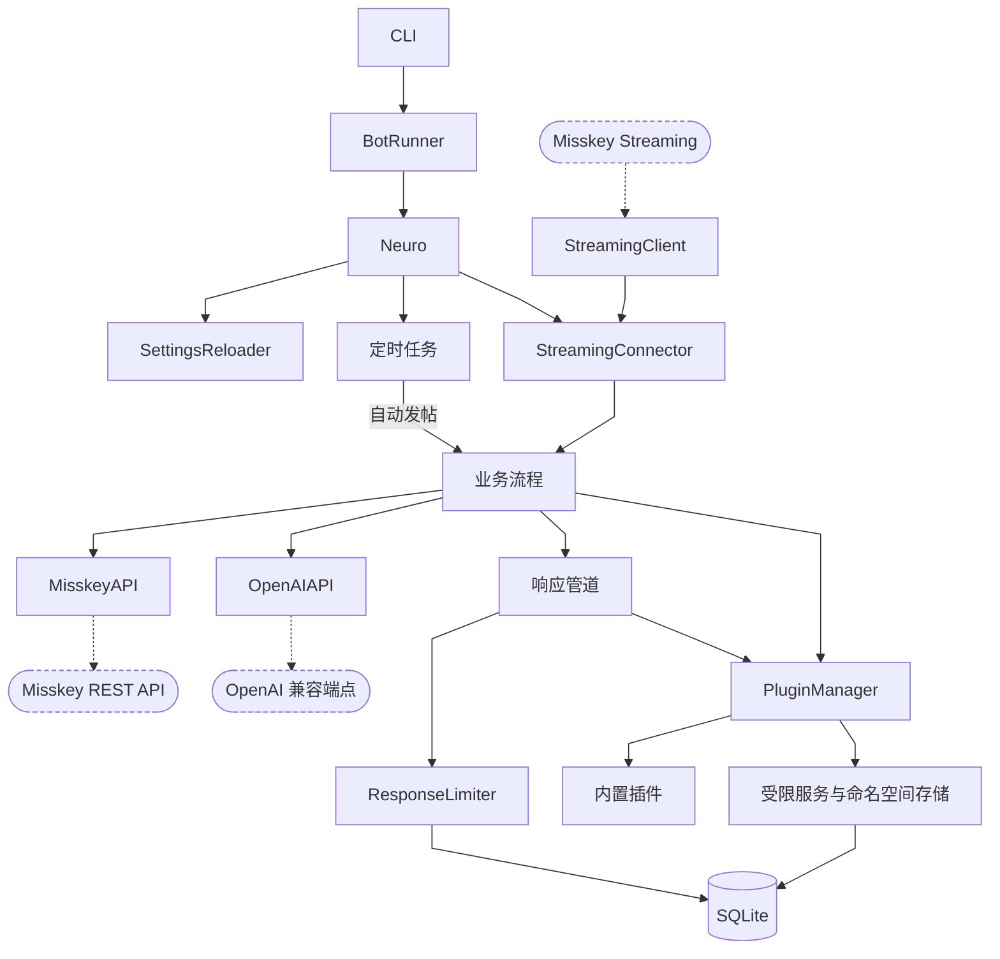

# 架构

单进程异步应用。核心负责连接、事件分发、设置热重载与状态管理；插件经稳定上下文使用受限服务，不依赖内部实现。

## 概览


```mermaid
%%{init: {"flowchart": {"curve": "linear", "nodeSpacing": 32, "rankSpacing": 44}}}%%
flowchart TB
	CLI[CLI] --> Runner[BotRunner] --> Core[Neuro]
	Core --> Reloader[SettingsReloader]
	Core --> Scheduler[定时任务]
	Core --> Connector[StreamingConnector]
	MisskeyStream([Misskey Streaming]) -.-> Streaming[StreamingClient] --> Connector
	Scheduler -->|自动发帖| Flows[业务流程]
	Connector --> Flows

	Flows --> MisskeyAPI[MisskeyAPI] -.-> MisskeyREST([Misskey REST API])
	Flows --> OpenAI[OpenAIAPI] -.-> Endpoint([OpenAI 兼容端点])
	Flows --> Pipeline[响应管道] --> Limiter[ResponseLimiter]
	Flows & Pipeline --> Plugins[PluginManager]
	Plugins --> Builtins[内置插件]
	Plugins --> Services[受限服务与命名空间存储]
	Limiter & Services --> SQLite[(SQLite)]

	classDef ext stroke-dasharray: 4 3
	class MisskeyStream,MisskeyREST,Endpoint ext
```

## 目录

```text
twipsybot/
├── twipsybot/
│   ├── admin/          管理命令
│   ├── app/            CLI、进程启动、信号与退出码
│   ├── bot/
│   │   ├── engine/     核心编排、连接、热重载、限流、响应管道与运行状态
│   │   └── flows/      提及、聊天、通知、发帖与图片流程
│   ├── clients/
│   │   ├── misskey/    REST 与 Streaming 客户端
│   │   └── openai/     OpenAI 兼容客户端
│   ├── db/             SQLite 状态存储
│   ├── plugin/         插件公共 API、契约与加载器
│   ├── shared/         配置模型、设置 IO、常量、异常、锁与工具
│   └── tui/            Textual 配置界面
├── plugins/            内置插件
├── tests/              core/（核心）与 plugins/（内建插件）测试
└── docs/               文档站点
```

`Neuro`（`bot/engine/core.py`）是对象图根：装配 engine 组件与 flows，编排启停，并作为 `bot` 供 flow 回调；插件仅经 `BotControlAdapter` 受限访问。

| 配置模块 | 职责 |
| --- | --- |
| `shared/config.py` | Settings、Secrets 模型；合并设置文件、连接信息与环境变量 |
| `shared/settings.py` | 设置文件读取、原子写入、默认值裁剪与补丁合并 |
| `bot/engine/reload.py` | `SettingsReloader`：轮询并热应用设置，标记需重启字段 |
| `tui/schema.py` | 由 Pydantic 模型生成表单 |
| `tui/app.py`、`app.tcss` | Textual 应用与样式 |

## 启动与停止

`twipsybot run` → `twipsybot.app.cli` → `BotRunner`：

1. 初始化日志，加载设置、连接信息与环境变量覆盖（仅 `connect` 支持环境变量）。
2. 配置无效、鉴权或连接失败时记录 `Startup blocked` 并等待设置变更；网络问题造成的连接失败每 60 秒重试。
3. 创建 `Neuro`，初始化 SQLite、自动发帖状态与机器人身份。
4. 加载插件与管理命令，执行 `on_startup()`。
5. 启动设置轮询与定时任务，连接 Streaming。
6. 收到信号后依次关闭轮询器、插件、客户端与数据库。

Linux 处理 `SIGINT`、`SIGTERM`、`SIGHUP`，Windows 处理 `SIGINT`、`SIGTERM`。停止时先暂停新 Hook，再等待进行中的 Hook。

## 热重载

`SettingsReloader` 约每 2 秒检查 `settings.yaml`、`secrets.yaml` 及 `bot.system_prompt`、`autopost.prompt` 引用的 `prompts/*.txt`：

- 有效变更即时应用，无效文件记录错误并保留当前设置。
- `connect` 与 `timeline.*` 标记为需重启。
- 插件配置变更由 `PluginManager` 以新配置重建对应插件。

`twipsybot cfg` 保存时合并到最新文件且只写非默认字段，避免覆盖管理命令的并发写入。

## 响应管道

私聊与提及按用户串行，房间消息按房间串行；房间消息仅在提及机器人时处理，且忽略 `^` 命令。管理命令走独立分支，不计入回复限制。普通消息：

1. 校验黑名单、间隔与轮数，白名单与管理员豁免后两者。
2. 按优先级调用插件 Hook，返回 handled 结果即发送并终止。
3. 无插件接管时调用文本模型。
4. 发送回复，更新限制状态与聊天上下文。

## 数据与并发

- SQLite 保存轮转模式当日发帖数、回复限制状态与插件私有数据；管理命令改写 `settings.yaml` 而非数据库。
- 插件仅通过命名空间隔离的 `PluginStorage` 读写字符串。
- 回复限制状态带内存缓存，以 SQLite 为准；聊天历史短期缓存，过期从 Misskey 重新获取。
- actor lock 串行化同一用户的操作；不同用户与事件并发，共享内存状态需自行同步。
- 超时：Hook 180 秒，生命周期方法 30 秒；关闭时为 Hook 保留 3 秒，整体最多 5 秒。

## 修改原则

- 协议差异放 `clients`，业务流程放 `flows`，跨流程状态与调度放 `engine`。
- 可独立启停的能力优先做成插件。
- 插件能力只经 `twipsybot.plugin` 暴露，不泄露内部对象。
- 设置读写统一走 `shared.config` 与 `shared.settings`，不直接解析 YAML。
